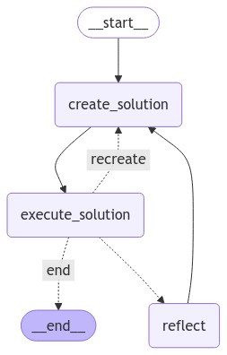

# Cli Agent

A LangChain agent that executes cli commands.

## Install

Use `poetry install` to install the dependencies of the project.

## Run

In the .env file that is placed in the project root directory, add ```OPENAI_API_KEY="sk-..." OpenAI API key for the GPT4 model.```


Use `poetry run python cli-agent/api.py` to start the development server, and use
```bash
curl \
  -H 'Content-Type: application/json' \
  -d '{"msg": "create a file named random.txt in the working directory, its content should be a paragraph on LLMs."}' \
  -X POST 'http://127.0.0.1:8000/agent'
```
to send a request to the API.

## Tests

To test the agent, run ```poetry run pytest```. It will test creation of files, deletion of files and moving of files.

## Security

To avoid agent executing anything dangerous, execute the agent in a restricted access environment, such as Docker.

to send a basic POST request to the server.

## LangGraph Workflow


