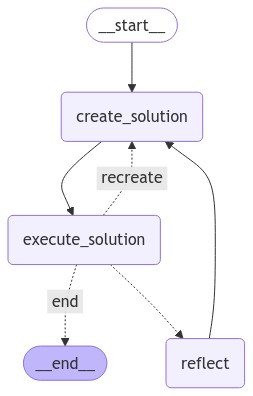

# Cli Agent

A LangChain agent that executes cli commands.

## Install

Use `poetry install` to install the dependencies of the project.

## Run

Use `poetry run python cli-agent/api.py` to start the development server, and use

```bash
curl \
  -H 'Content-Type: application/json' \
  -d '{"msg": "create a file named random.txt in the working directory, its content should be a paragraph on LLMs."}' \
  -X POST 'http://127.0.0.1:8000/agent'
```

to send a basic POST request to the server.

